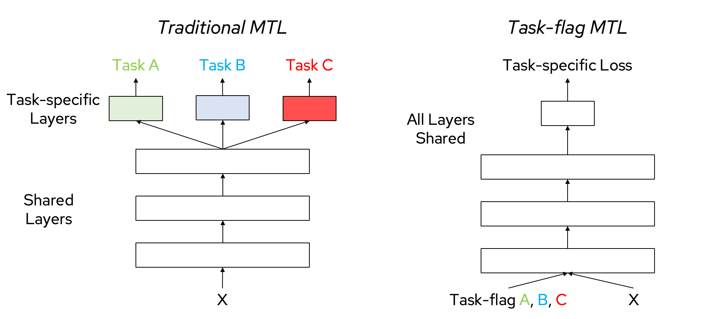

## Explicit Adaptivity: Structured Estimation of $f(c)$

In classical statistical modeling, all observations are typically assumed to share a common set of parameters. However, modern datasets often display significant heterogeneity across individuals, locations, or experimental conditions, making this assumption unrealistic in many real-world applications. To better capture such heterogeneity, recent approaches model parameters as explicit functions of observed context, formalized as $\theta_i = f(c_i)$, where $f$ maps each context to a sample-specific parameter [@doi:10.1111/j.2517-6161.1993.tb01939.x].

A familiar example of explicit adaptivity is multi-task learning, where context is defined by task identity. Traditional multi-task learning (left) assigns each task its own head on top of shared representations, while context-flagged models (right) pass task identity directly as an input, enabling richer parameter sharing. This illustrates how explicit conditioning on context variables can unify tasks within a single model and provides an intuitive entry point to more general forms of explicit adaptivity (Figure {@fig:mtl-context}).

{#fig:mtl-context width="75%"}

The workhorse formalism for explicit adaptivity is the varying-coefficient model (VCM), which writes each regression coefficient as a function of context [@doi:10.1111/j.2517-6161.1993.tb01939.x; @doi:10.3390/publications13020019]:

$$
y_i = \sum_{j=1}^{p} \beta_j(c_i)\, x_{ij} + \varepsilon_i .
$$

Every method in this section is, at its core, a different way to estimate the maps $\beta_j(\cdot)$, or more generally $f(\cdot)$. We organize them along an axis of increasingly sophisticated statistical and machine-learning concepts. Each step forward increases the power of context-specific, personalized inference by borrowing strength from related samples and groups. Read the other way, each step lowers the amount of data that must be collected for any single group, because information flows in from neighboring contexts rather than being estimated in isolation. The progression runs from subgroups that share nothing, through mechanisms that share progressively more, to fully learned functions of context: kernel localization that dissolves boundaries entirely, structured parametric maps that learn which context features matter, and finally contextualized models that learn arbitrary context dependencies. Running alongside this is a parallel case in which the models being adapted become increasingly sophisticated, going from linear models to graphical models whose structure, and not only its values, follows context.

### Independent Subgroups

The most basic response to heterogeneity is to split the data into subgroups and fit each one on its own. Conditional and clustered models define groups by hand, for example by sex or site, or by unsupervised clustering, and estimate a separate parameter vector within each group with no sharing between them. This removes the bias of a single global fit, but it is the most data-hungry option available: each group is estimated only from its own samples, so small groups are estimated poorly and unseen groups not at all. Every later step can be read as a way to relax this isolation, buying more reliable per-group estimates from less per-group data.

### Sharing Across Groups

The first improvement keeps discrete groups but couples their estimates. Distance-regularized estimation asks that observations with similar contexts have similar parameters, penalizing differences in $\theta_i$ in proportion to context distance, while fused-lasso and total-variation penalties shrink differences between adjacent groups so that estimates borrow strength from their neighbors [@doi:10.1214/09-AOAS308]. The effect is to lower the effective data requirement per group: a sparsely observed context inherits information from well-observed relatives rather than standing alone.

The same idea carries over from regressors to network estimators. The graphical-model lineage established that a parameter can be an estimated network: zeros in the inverse covariance matrix encode conditional independencies [@doi:10.2307/2528966; @doi:10.1093/oso/9780198522195.001.0001], and neighborhood selection and the graphical lasso recover sparse structure directly from data [@doi:10.1214/009053606000000281; @doi:10.1093/biostatistics/kxm045], with later extensions estimating this structure when each node carries a vector of attributes rather than a scalar [@arxiv:1210.7665]. 

These approaches primarily use regularizers to enforce graph structure, which provides a direct tangent to the regression estimators that share information across a discrete set of conditions by coupling network regularization across groups. Guo et al. jointly estimate several graphical models, encouraging sparsity within each while borrowing strength across related groups [@doi:10.1093/biomet/asq060], and the Joint Graphical Lasso balances shared structure against group-specific edges across populations [@doi:10.1111/rssb.12033]. Bayesian formulations achieve the same pooling through priors rather than penalties: lattice and Markov-random-field spike-and-slab priors learn when edges should be shared across neighboring sites or sample groups, and quantify how similar the resulting networks are [@doi:10.1198/jasa.2011.tm10465; @doi:10.1080/01621459.2014.896806].

### Learning the Group Boundaries

Thus far group-based modeling has required knowing which groups to model ahead of estimation. The next step lets the data decide where the boundaries fall. Model-based recursive partitioning fits a parametric model, tests its coefficients for instability across candidate context variables, and splits on the variable with the strongest instability before recursing, so the partition is chosen by the data rather than pre-specified [@doi:10.1198/106186008X319331]; toolkits such as partykit fit a parametric model within each leaf [@hothorn2015partykit]. In the network case the same move recovers where structure changes. Varying-coefficient varying-structure (VCVS) graphical models treats both the edge set and the edge weights as functions of context, and when structure changes abruptly a temporally smoothed penalty recovers the changepoints together with the precision matrix on each block, the first such estimators shown to be sparsistent with established convergence rates [@doi:10.1214/12-EJS739; @kolar2009sparsistent]. TREEGL extends this to a tree of networks that switch along a branching biological lineage, borrowing strength between a parent cell type and its descendants while exposing the edges that change at each division [@doi:10.1093/bioinformatics/btr239; @doi:10.1371/journal.pcbi.1003713].

Viewing a partition as explicit routing clarifies what these splits accomplish. Each split of the context space sends samples to a distinct parameter vector, so the boundaries encode exactly where parameters are shared and where they are separated. Hierarchical partitions capture heterogeneity at two levels, sample-level variation within a context and task-level switching across contexts, which connects partition-based models to multi-task learning (Figure {@fig:context-splits}). This explicit routing is the structured counterpart of the implicit routing performed by mixture-of-experts and attention layers in the next section, where the same shared-versus-separated decision is made inside the network rather than by an overt split. 

{#fig:context-splits width="75%"}

### Dissolving the Boundaries with Kernels

Partitions, however they are drawn, still impose hard boundaries. Kernel and locally weighted methods remove them, estimating a separate model at each query context from a similarity-weighted neighborhood of samples. This is the classical varying-coefficient setting, where coefficients are smooth functions of a low-dimensional context estimated with kernel smoothing, local polynomials, or penalized splines. For a query context $c^\ast$, a semiparametric VCM solves

$$
\widehat{\theta}(c^\ast) = \arg\max_{\theta} \sum_{i=1}^n K_\lambda(c_i, c^\ast)\,\ell(x_i; \theta),
$$

where $K_\lambda$ measures similarity between contexts and $\ell$ is the per-sample log-likelihood, so prediction at $c^\ast$ is a similarity-weighted combination of nearby observations. Because every sample contributes in proportion to its context similarity, no single group needs to be large; the neighborhood supplies the data. Reproducing-kernel methods extend this to higher dimensions while retaining guarantees, for example penalized RKHS estimators for partially varying-coefficient models that separate constant from smoothly varying effects with minimax prediction rates and consistent structure selection [@doi:10.1016/j.csda.2020.107039], and the same machinery underlies generalized additive models. This locally weighted view is also the thread a later section follows to show that transformers performing in-context learning realize the same estimator, with a learned attention kernel taking the place of $K_\lambda$.

Similarity can be defined over a topology rather than a continuous covariate. Spatially varying-coefficient models let local effects change gradually across adjacent regions [@doi:10.48550/arXiv.2410.07229; @doi:10.48550/arXiv.2502.14651], the network varying-coefficient model learns latent node positions and coefficient functions on a graph [@doi:10.1080/01621459.2025.2470481], and Laplacian or nested-group penalties encode smoothness over temporal, hierarchical, or multilevel structure. The network-valued case appears here too: kernel reweighting and total-variation penalties estimate a separate network at each point along a context axis, as in TESLA and related kernel-reweighted and time-varying network estimators for rewiring gene-regulatory and political networks [@doi:10.1073/pnas.0901910106; @doi:10.1214/09-AOAS308; @doi:10.1093/bioinformatics/btp192; @song2009tvdbn; @kolar2011timevarying], and covariate-dependent Bayesian graph learning lets network structure vary smoothly with observed covariates through a dual spike-and-slab prior that selects at node, covariate, and local levels [@doi:10.1093/biomtc/ujaf053].

### Structured Parametric Maps

Kernel methods treat the context dimensions symmetrically through the similarity metric. The next step learns which dimensions matter. Structured parametric VCMs impose form on $f$, from the linear map $\theta_i = A c_i$ to sparsity and group penalties on the coefficient functions, so that estimation both adapts the parameters and identifies the context features driving that adaptation. Tree-based ensembles are the high-capacity realization of this idea for tabular and mixed-type data: Tree Boosted Varying-Coefficient Models estimate context-dependent coefficients with gradient-boosted trees, balancing flexibility, accuracy, and interpretability while remaining easier to tune than deep networks [@doi:10.48550/arXiv.1904.01058]; cyclic gradient boosting adds dimension-wise early stopping and feature-importance measures [@doi:10.48550/arXiv.2401.05982]; and VCBART embeds Bayesian Additive Regression Trees into the varying-coefficient framework, estimating complex effect modifiers with coherent uncertainty quantification and good scaling in high dimensions [@doi:10.1214/24-BA1470]. What these share is a readout of context relevance, through split statistics, feature importances, or posterior inclusion, that the kernel view does not provide.

### From Composition to Learned Functions

The boundary between parametric and nonparametric adaptivity is porous. If we fit simple parametric models within each context, for observed contexts $c$ or latent subcontexts $Z$, and then aggregate across contexts, the resulting conditional

$$
P(Y\mid X,C) \;=\; \int P(Y\mid X,C,Z)\, dP(Z\mid C)
$$

can display rich, multimodal behavior that looks nonparametric. Global flexibility can emerge from compositional, context-specific parametrics. When component families are identifiable or suitably regularized and the context-to-mixture map is constrained by smoothness, total variation, or sparsity over $c$, the aggregate model remains estimable and interpretable while avoiding overflexible, ill-posed mixtures (Figure {@fig:compositional-inference}).

{#fig:compositional-inference width="85%"}

This perspective motivates flexible function approximators: trees and neural networks can be read as learning either the context-to-mixture weights or the local parametric maps. The final step lets that function be arbitrary.

### Contextualized Models: Arbitrary Functions of Context

For contexts defined by high-dimensional or unstructured features such as images, text, or sequences, deep neural networks approximate $f(c)$ without committing to a fixed basis, partition, or similarity metric. A network can consume context as input and let its nonlinear layers induce context-dependent behavior, the pattern that reappears for implicit models in the next section; it can generate the parameters of another model directly, as in hypernetworks, which give an explicit deep-net realization of $\theta = f(c)$ [@doi:10.48550/arXiv.1609.09106]; or it can modulate a shared backbone through feature-wise affine transformations supplied by context, as in FiLM [@doi:10.48550/arXiv.1709.07871]. Taking this to its limit yields contextualized models, which treat $f$ as an unrestricted map learned end-to-end and estimate it directly, capturing complex functions of context including the feature interactions that the structured maps above cannot express [@doi:10.48550/arXiv.2310.11340]. A single deep encoder reads a sample's context and emits the parameters of its downstream model, so estimation is amortized across contexts: the cost is paid once during training, and inference for a new context is a forward pass that needs no per-group data at all. The formulation spans model types and domains, including personalized disease models [@doi:10.1073/pnas.2411930122; @doi:10.48550/arXiv.2111.01104], heterogeneous treatment effects [@doi:10.1016/j.jbi.2022.104086; @doi:10.48550/arXiv.2310.07918], drug development [@doi:10.64898/2026.05.11.724149], and contextual feature selection [@doi:10.48550/arXiv.2312.14254], with standard implementations in the contextualized.ml package [@doi:10.21105/joss.06469]. The network-valued thread reaches the same endpoint: personalized regression and Bayesian edge-regression models learn a map from a sample's covariates or latent similarity to its own network, recovering subject-specific structure rather than a shared group label [@doi:10.1093/bioinformatics/bty250; @doi:10.1080/01621459.2021.2000866]. Because the encoder infers parameters from context alone, it is the explicit object the next section reaches back to when it interprets an amortized context encoder as the bridge to in-context learning.

### Beyond Covariates: What Serves as Context

Context need not be a covariate, a task identifier, or a position in a sequence. Any signal the model can condition on can serve as context, and a useful example is the pattern of missing measurements itself. Combining real-world datasets is complicated by inconsistent measurement: different cohorts or institutions collect different subsets of features, so naive pooling yields a sparse, unbalanced feature matrix, while discarding incomplete samples wastes data. Context-adaptive models resolve this by treating measurement sparsity as context. Rather than ignoring missingness, the model adjusts its parameterization to which features are observed, so that each measurement policy, whether labs-only, vitals-only, or multimodal, defines a context and information is shared across policies while their differences are respected. This reframes missingness from a nuisance into structured signal that encodes which sources of evidence are available and how they should be combined, an idea also pursued in multimodal learning frameworks that handle missing modalities [@doi:10.48550/arXiv.2409.07825]. By conditioning on measurement availability, a model learns from fewer individuals with more heterogeneous features (Figure {@fig:sparsity-context}). The metrics and stress tests specific to missingness-as-context are collected with the shared evaluation principles later in the review.

{#fig:sparsity-context width="70%"}

### Key Theoretical Advances

The guarantees available for these methods reflect the assumptions each one makes, and they track the progression above.

#### Partitions and learned boundaries

For grouped and partition-based estimators, change-point analysis and total-variation regularization establish when abrupt parameter changes can be recovered. Under suitable sparsity and signal-strength conditions, fused-lasso and total-variation penalties recover both the location of the changepoints and the parameters on each piecewise-constant block [@doi:10.1214/09-AOAS308].

#### Kernel and smooth estimation

For kernel smoothing, local polynomial estimation, and penalized splines, convergence rates and efficiency are well characterized. Under standard regularity conditions these estimators achieve minimax-optimal rates for function estimation in moderate dimensions [@doi:10.1111/j.2517-6161.1993.tb01939.x], and Lu, Zhang, and Zhu established consistency and asymptotic normality for penalized spline estimators given a sufficient number of knots and appropriate penalties, enabling valid inference through confidence intervals and hypothesis tests [@doi:10.1080/03610920801931887].

#### Structure-varying estimation

When the support itself varies with context, analysis centers on identifiability, sparsistency, and consistent recovery of the changing structure. The VCVS estimators of Kolar and Xing were the first shown to be sparsistent with established convergence rates when the network changes abruptly over time [@kolar2009sparsistent; @doi:10.1214/12-EJS739], and for networked coefficients non-asymptotic error bounds show that consistency is attainable when the underlying graph topology is sufficiently connected [@doi:10.1080/01621459.2025.2470481].

#### Learned and high-capacity models

High-capacity approximators raise harder questions. In high-dimensional and sparse settings, oracle inequalities and penalized-likelihood theory give conditions for consistent variable selection and accurate estimation, including for boosting-based estimators. For neural-network realizations of $f(c)$, generalization and identifiability under non-convex optimization remain only partly understood and are an active frontier for both the statistics and machine learning communities.

### Future Directions

One direction integrates varying-coefficient models with foundation models from language and vision. Using pretrained embeddings as the context $c_i$ lets these models absorb large amounts of prior knowledge and extend to multimodal and unstructured sources, and the principled combination of cross-modal contexts, bringing text, images, and structured covariates into a single framework, remains an open problem.

Interpretability and visualization for high-dimensional or black-box coefficient functions are equally important. Tools that let users understand and trust estimated coefficient surfaces are a prerequisite for adoption in sensitive areas such as healthcare and policy.

Finally, the gap between methodological innovation and practical deployment remains. Many capable VCM variants exist, but adoption is often limited by the availability of software and the clarity of methodological guidance [@doi:10.3390/publications13020019]. Continued investment in usable implementations, open-source libraries, and empirical benchmarks will broaden adoption and impact. Explicit adaptivity now spans this full progression, from independent subgroups to amortized deep encoders; the principles for evaluating and deploying any point on it, shared with the implicit methods of the next section, are the subject of a later chapter.
