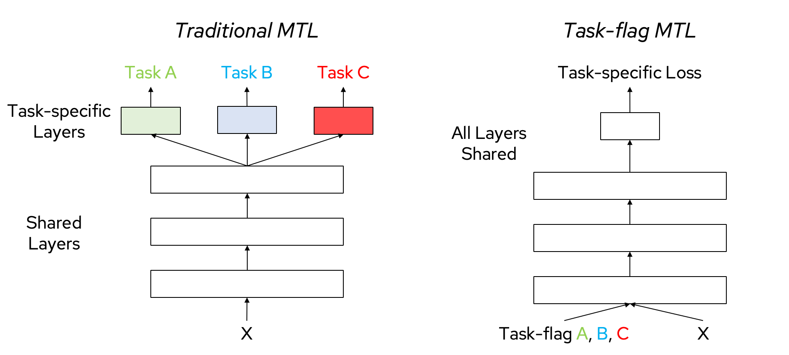
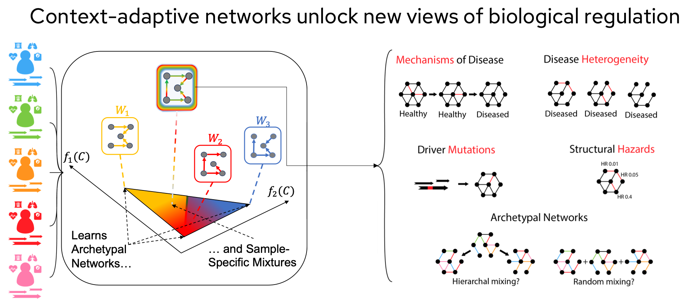

---
title: 'Context-Adaptive Inference: Bridging Statistical and Foundation Models'
keywords:
- markdown
- publishing
- manubot
lang: en-US
date-meta: '2025-09-13'
author-meta:
- Ben Lengerich
- Caleb N. Ellington
- Yue Yao
- Dong Liu
header-includes: |
  <!--
  Manubot generated metadata rendered from header-includes-template.html.
  Suggest improvements at https://github.com/manubot/manubot/blob/main/manubot/process/header-includes-template.html
  -->
  <meta name="dc.format" content="text/html" />
  <meta property="og:type" content="article" />
  <meta name="dc.title" content="Context-Adaptive Inference: Bridging Statistical and Foundation Models" />
  <meta name="citation_title" content="Context-Adaptive Inference: Bridging Statistical and Foundation Models" />
  <meta property="og:title" content="Context-Adaptive Inference: Bridging Statistical and Foundation Models" />
  <meta property="twitter:title" content="Context-Adaptive Inference: Bridging Statistical and Foundation Models" />
  <meta name="dc.date" content="2025-09-13" />
  <meta name="citation_publication_date" content="2025-09-13" />
  <meta property="article:published_time" content="2025-09-13" />
  <meta name="dc.modified" content="2025-09-13T22:15:45+00:00" />
  <meta property="article:modified_time" content="2025-09-13T22:15:45+00:00" />
  <meta name="dc.language" content="en-US" />
  <meta name="citation_language" content="en-US" />
  <meta name="dc.relation.ispartof" content="Manubot" />
  <meta name="dc.publisher" content="Manubot" />
  <meta name="citation_journal_title" content="Manubot" />
  <meta name="citation_technical_report_institution" content="Manubot" />
  <meta name="citation_author" content="Ben Lengerich" />
  <meta name="citation_author_institution" content="Department of Statistics, University of Wisconsin-Madison" />
  <meta name="citation_author_orcid" content="0000-0001-8690-9554" />
  <meta name="twitter:creator" content="@ben_lengerich" />
  <meta name="citation_author" content="Caleb N. Ellington" />
  <meta name="citation_author_institution" content="Computational Biology Department, Carnegie Mellon University" />
  <meta name="citation_author_orcid" content="0000-0001-7029-8023" />
  <meta name="twitter:creator" content="@probablybots" />
  <meta name="citation_author" content="Yue Yao" />
  <meta name="citation_author_institution" content="Department of Statistics, University of Wisconsin-Madison" />
  <meta name="citation_author_orcid" content="0009-0000-8195-3943" />
  <meta name="citation_author" content="Dong Liu" />
  <meta name="citation_author_institution" content="Department of Computer Science, Yale University" />
  <meta name="citation_author_orcid" content="0009-0009-6815-8297" />
  <meta name="twitter:creator" content="@None" />
  <link rel="canonical" href="https://AdaptInfer.github.io/context-review/" />
  <meta property="og:url" content="https://AdaptInfer.github.io/context-review/" />
  <meta property="twitter:url" content="https://AdaptInfer.github.io/context-review/" />
  <meta name="citation_fulltext_html_url" content="https://AdaptInfer.github.io/context-review/" />
  <meta name="citation_pdf_url" content="https://AdaptInfer.github.io/context-review/manuscript.pdf" />
  <link rel="alternate" type="application/pdf" href="https://AdaptInfer.github.io/context-review/manuscript.pdf" />
  <link rel="alternate" type="text/html" href="https://AdaptInfer.github.io/context-review/v/0d24bcfe587405e187a9ad584591302ef1cdaeb1/" />
  <meta name="manubot_html_url_versioned" content="https://AdaptInfer.github.io/context-review/v/0d24bcfe587405e187a9ad584591302ef1cdaeb1/" />
  <meta name="manubot_pdf_url_versioned" content="https://AdaptInfer.github.io/context-review/v/0d24bcfe587405e187a9ad584591302ef1cdaeb1/manuscript.pdf" />
  <meta property="og:type" content="article" />
  <meta property="twitter:card" content="summary_large_image" />
  <link rel="icon" type="image/png" sizes="192x192" href="https://manubot.org/favicon-192x192.png" />
  <link rel="mask-icon" href="https://manubot.org/safari-pinned-tab.svg" color="#ad1457" />
  <meta name="theme-color" content="#ad1457" />
  <!-- end Manubot generated metadata -->
bibliography:
- content/manual-references.json
manubot-output-bibliography: output/references.json
manubot-output-citekeys: output/citations.tsv
manubot-requests-cache-path: ci/cache/requests-cache
manubot-clear-requests-cache: false
...

<small><em>
This manuscript
([permalink](https://AdaptInfer.github.io/context-review/v/0d24bcfe587405e187a9ad584591302ef1cdaeb1/))
was automatically generated
from [AdaptInfer/context-review@0d24bcf](https://github.com/AdaptInfer/context-review/tree/0d24bcfe587405e187a9ad584591302ef1cdaeb1)
on September 13, 2025.
</em></small>

## Authors

+ **Ben Lengerich**
   
    {.inline_icon width=16 height=16}
    [0000-0001-8690-9554](https://orcid.org/0000-0001-8690-9554)
    · {.inline_icon width=16 height=16}
    [blengerich](https://github.com/blengerich)
    · {.inline_icon width=16 height=16}
    [ben_lengerich](https://twitter.com/ben_lengerich)
     
  <small>
     Department of Statistics, University of Wisconsin-Madison
     · Funded by None
  </small>

+ **Caleb N. Ellington**
   
    {.inline_icon width=16 height=16}
    [0000-0001-7029-8023](https://orcid.org/0000-0001-7029-8023)
    · {.inline_icon width=16 height=16}
    [cnellington](https://github.com/cnellington)
    · {.inline_icon width=16 height=16}
    [probablybots](https://twitter.com/probablybots)
     
  <small>
     Computational Biology Department, Carnegie Mellon University
     · Funded by None
  </small>

+ **Yue Yao**
   
    {.inline_icon width=16 height=16}
    [0009-0000-8195-3943](https://orcid.org/0009-0000-8195-3943)
    · {.inline_icon width=16 height=16}
    [YueYao-stat](https://github.com/YueYao-stat)
     
  <small>
     Department of Statistics, University of Wisconsin-Madison
     · Funded by None
  </small>

+ **Dong Liu**
   
    {.inline_icon width=16 height=16}
    [0009-0009-6815-8297](https://orcid.org/0009-0009-6815-8297)
    · {.inline_icon width=16 height=16}
    [NoakLiu](https://github.com/NoakLiu)
     
  <small>
     Department of Computer Science, Yale University
     · Funded by None
  </small>

::: {#correspondence}
✉ — Correspondence possible via [GitHub Issues](https://github.com/AdaptInfer/context-review/issues)

:::

## Abstract {.page_break_before}

Context-adaptive inference enables models to adjust their behavior across individuals, environments, or tasks. 
This adaptivity may be *explicit*, through parameterized functions of context, or *implicit*, as in foundation models that respond to prompts and support in-context learning. 
In this review, we connect recent developments in varying-coefficient models, contextualized learning, and in-context learning. 
We highlight how foundation models can serve as flexible encoders of context, and how statistical methods offer structure and interpretability. 
We propose a unified view of context-adaptive inference and outline open challenges in developing scalable, principled, and personalized models that adapt to the complexities of real-world data.

## Introduction

A convenient simplifying assumption in statistical modeling is that observations are independent and identically distributed (i.i.d.). 
This assumption allows us to use a single model to make predictions across all data points. 
But in practice, this assumption rarely holds. 
Data are collected across different individuals, environments, and tasks -- each with their own characteristics, constraints, and dynamics.

To model this heterogeneity, a growing class of methods aim to make inference *adaptive to context*. These include varying-coefficient models in statistics, transfer and meta-learning in machine learning, and in-context learning in large foundation models. Though these approaches arise from different traditions, they share a common goal: to use contextual information -- whether covariates, environments, or support sets -- to inform sample-specific inference.

We formalize this by assuming each observation $x_i$ is drawn from a distribution governed by parameters $\theta_i$:

$$
x_i \sim P(x; \theta_i).
$$

In population models, the assumption is that $\theta_i = \theta$ for all $i$. In context-adaptive models, we instead posit that the parameters vary with context:

$$
\theta_i = f(c_i) \quad \text{or} \quad \theta_i \sim P(\theta \mid c_i),
$$

where $c_i$ captures the relevant covariates or environment for observation $i$. The goal is to estimate either a deterministic function $f$ or a conditional distribution over parameters.

This shift raises new modeling challenges. 
Estimating a unique $\theta_i$ from a single observation is ill-posed unless we impose structure—smoothness, sparsity, shared representations, or latent grouping. 
And as adaptivity becomes more implicit (e.g., via neural networks or black-box inference), we must develop tools to recover, interpret, or constrain the underlying parameter variation.

In this review, we examine methods that use context to guide inference, either by specifying how parameters change with covariates or by learning to adapt behavior implicitly. 
We begin with classical models that impose explicit structure—such as varying-coefficient models and multi-task learning—and then turn to more flexible approaches like meta-learning and in-context learning with foundation models. 
Though these methods arise from different traditions, they share a common goal: to tailor inference to the local characteristics of each observation or task. 
Along the way, we highlight recurring themes: complex models often decompose into simpler, context-specific components; foundation models can both adapt to and generate context; and context-awareness challenges classical assumptions of homogeneity. 
These perspectives offer a unifying lens on recent advances and open new directions for building adaptive, interpretable, and personalized models.

## From Population Assumptions to Context-Adaptive Inference

Most statistical and machine learning models begin with a foundational assumption: that all samples are drawn independently and identically from a shared population distribution. This assumption simplifies estimation and enables generalization from limited data, but it collapses in the presence of meaningful heterogeneity.

In practice, data often reflect differences across individuals, environments, or conditions. These differences may stem from biological variation, temporal drift, site effects, or shifts in measurement context. Treating heterogeneous data as if it were homogeneous can obscure real effects, inflate variance, and lead to brittle predictions.

### Failure Modes of Population Models

Even when traditional models appear to fit aggregate data well, they may hide systematic failure modes.

**Mode Collapse**  
When one subpopulation is much larger than another, standard models are biased toward the dominant group, underrepresenting the minority group in both fit and predictions.

**Outlier Sensitivity**  
In the parameter-averaging regime, small but extreme groups can disproportionately distort the global model, especially in methods like ordinary least squares.

**Phantom Populations**  
When multiple subpopulations are equally represented, the global model may fit none of them well, instead converging to a solution that represents a non-existent average case.

These behaviors reflect a deeper problem: the assumption of identically distributed samples is not just incorrect, but actively harmful in heterogeneous settings.

### Toward Context-Aware Models

To account for heterogeneity, we must relax the assumption of shared parameters and allow the data-generating process to vary across samples. A general formulation assumes each observation is governed by its own latent parameters:
$$
x_i \sim P(x; \theta_i),
$$

However, estimating $N$ free parameters from $N$ samples is underdetermined. 
Context-aware approaches resolve this by introducing structure on how parameters vary, often by assuming that $\theta_i$ depends on an observed context $c_i$:

$$
\theta_i = f(c_i) \quad \text{or} \quad \theta_i \sim P(\theta \mid c_i).
$$

This formulation makes the model estimable, but it raises new challenges. 
How should $f$ be chosen? How smooth, flexible, or structured should it be? The remainder of this review explores different answers to this question, and shows how implicit and explicit representations of context can lead to powerful, personalized models.

A classical example of this challenge arises in causal inference. 
Following the Neyman–Rubin potential outcomes framework, we let $Y(1)$ and $Y(0)$ denote 
the outcomes that would be observed under treatment and control, respectively. 
The average treatment effect (ATE) is then $E[Y(1) - Y(0)]$, or more generally the conditional 
average treatment effect (CATE) given covariates. 
Standard approaches often condition only on $X$, while heterogeneous treatment effect (HTE) 
models incorporate additional context $C$ to capture systematic variation across subpopulations 
(Figure {@fig:hte-context}).

{#fig:hte-context width="70%"}

These models highlight both the promise and the challenges of choosing and estimating $f(c)$.

### Early Remedies: Grouped and Distance-Based Models

Before diving into flexible estimators of $f(c)$, we review early modeling strategies that attempt to break away from homogeneity.

#### Conditional and Clustered Models

One approach is to group observations into C contexts, either by manually defining conditions (e.g. male vs. female) or using unsupervised clustering. Each group is then assigned a distinct parameter vector:

$$
\{\widehat{\theta}_0, \ldots, \widehat{\theta}_C\} = \arg\max_{\theta_0, \ldots, \theta_C} \sum_{c \in \mathcal{C}} \ell(X_c; \theta_c),
$$
where $\ell(X; \theta)$ is the log-likelihood of $\theta$ on $X$ and $c$ specifies the covariate group that samples are assigned to. This reduces variance but limits granularity. It assumes that all members of a group share the same distribution and fails to capture variation within a group.

#### Distance-Regularized Estimation

A more flexible alternative assumes that observations with similar contexts should have similar parameters. This is encoded as a regularization penalty that discourages large differences in $\theta_i$ for nearby $c_i$:

$$
\{\widehat{\theta}_0, \ldots, \widehat{\theta}_N\} = \arg\max_{\theta_0, \ldots, \theta_N} \left( \sum_i \ell(x_i; \theta_i) - \sum_{i,j} \frac{\|\theta_i - \theta_j\|}{D(c_i, c_j)} \right),
$$

where $D(c_i, c_j)$ is a distance metric between contexts. This approach allows for smoother parameter variation but requires careful choice of $D$ and regularization strength $\lambda$ to balance bias and variance.  
The choice of distance metric D and regularization strength λ controls the bias–variance tradeoff.

### Parametric and Semi-parametric Varying-Coefficient Models

Varying-coefficient models (VCMs) provide one of the earliest formal frameworks for explicit adaptivity. Parametric VCMs assume that parameters vary linearly with covariates, a restrictive but interpretable assumption [@doi:10.1111/j.2517-6161.1993.tb01939.x]. The estimation can be written as
$$
\widehat{A} = \arg\max_A \sum_i \ell(x_i; A c_i).
$$
This formulation can be interpreted as a special case of distance-regularized estimation where the distance metric is Euclidean. Related developments in graphical models extend this idea to structured dependencies [@doi:10.1080/01621459.2021.2000866].

Semi-parametric VCMs relax the linearity assumption by requiring only that parameter variation be smooth. This is commonly encoded through kernel weighting, where the relevance of each sample is determined by its similarity in the covariate space [@doi:10.1214/aos/1017939139; @arxiv:2103.00315]. These models are more flexible but may fail when the true relationship between covariates and parameters is discontinuous.

### Contextualized Models

Contextualized models take a fully non-parametric approach, introduced in [@doi:10.48550/arXiv.1705.10301]. They assume that parameters are functions of context, $f(c)$, but do not restrict the form of $f$. Instead, $f$ is estimated directly, often with deep neural networks as function approximators:
$$
\widehat{f} = \arg \max_{f \in \mathcal{F}} \sum_i \ell(x_i; f(c_i)).
$$
This framework has been widely applied, from machine learning toolboxes [@doi:10.48550/arXiv.2310.11340; @doi:10.21105/joss.06469] to personalized genomics [@doi:10.1101/2023.12.01.569658; @doi:10.48550/arXiv.2111.01104], biomedical informatics [@doi:10.48550/arXiv.2310.07918; @doi:10.1016/j.jbi.2022.104086; @doi:10.1101/2020.06.25.20140053], and contextual feature selection [@doi:10.48550/arXiv.2312.14254]. These examples highlight how contextual signals can drive adaptation without assuming a fixed functional form.

### Partition and Latent-Structure Models

Partition models extend the contextualized framework by assuming that parameters can be divided into homogeneous groups, while leaving group boundaries to be inferred. This design is useful for capturing abrupt changes over covariates such as time. Estimation typically balances the likelihood with a penalty on parameter differences between adjacent samples, often expressed through a Total Variation (TV) penalty [@doi:10.1214/09-AOAS308]:
$$
\{\widehat{\theta}_0, \dots, \widehat{\theta}_N\} = \arg\max_{\theta_0, \dots, \theta_N} \left( \sum_i \ell(x_i; \theta_i) + \lambda \sum_{i = 2}^N \|\theta_i - \theta_{i-1}\| \right).
$$
By encouraging piecewise-constant structures, partition models get closer to personalized modeling, balancing fit and parsimony.

### Fine-tuned Models and Transfer Learning

Another practical strategy for handling heterogeneity is fine-tuning. A global population model is first estimated, and then a smaller set of parameters is updated for particular subpopulations. This idea underlies transfer learning, where large pre-trained models are adapted to new tasks with limited additional training [@doi:10.48550/arXiv.2206.02058]. Fine-tuning balances the bias–variance tradeoff by borrowing statistical strength from large datasets while preserving flexibility for local adaptation. This notion was already recognized in early VCM literature as a form of semi-parametric estimation [@doi:10.1214/aos/1017939139].

### Models for Explicit Subgroup Separation

Most adaptive methods encourage parameters for similar contexts to converge, but recent work explores the opposite: ensuring that models for distinct subgroups remain separated. This prevents minority subgroups from collapsing into majority patterns. Such “negative information sharing” is often implemented by learning representations that disentangle subgroup structure, bridging statistical partitioning with adversarial or contrastive learning objectives [@doi:10.48550/arXiv.1910.06939].

### A Spectrum of Context-Awareness

Context-aware models can be organized along a spectrum of assumptions about the relationship between context and parameters:

* **Global models**: $\theta_i = \theta$ for all $i$.
* **Grouped models**: $\theta_i = \theta_c$ for some finite set of groups.
* **Smooth models**: $\theta_i = f(c_i)$, with $f$ assumed to be continuous or low-complexity.
* **Latent models**: $\theta_i \sim P(\theta \mid c_i)$, with $f$ learned implicitly.

Each formulation encodes different beliefs about parameter variation. The next section formalizes these principles and examines general strategies for adaptivity in statistical modeling. For a discussion of how subpopulation shifts influence generalization, see [@arXiv:2106.04486].

## Principles of Context-Adaptive Inference

What makes a model adaptive? When is it good for a model to be adaptive? While the appeal of adaptivity lies in flexibility and personalized inference, not all adaptivity is beneficial. This section formalizes the core principles that underlie adaptive modeling and situates them within both classical statistics and recent advances in machine learning.

Adaptivity is best understood as a structured set of design choices rather than a single mechanism. Each principle described below highlights a different axis along which models can incorporate or restrict adaptation. Flexibility captures the representational capacity needed for adaptation, while signals of heterogeneity determine when adaptation is justified. Modularity helps organize adaptation into interpretable and transferable units, and selectivity guards against overfitting by controlling when adaptation is triggered. Data efficiency limits how finely we can adapt in practice, and tradeoffs remind us that adaptation is never free of cost. Together, these principles define both the promise and the risks of adaptive systems. 

We organize this section into six subsections, each addressing one principle. Afterward, we discuss failure modes and conclude with a synthesis that connects these ideas to practical implications.

### 1. Adaptivity requires flexibility
The first principle concerns model capacity. A model must be able to represent multiple behaviors if it is to adapt. Without sufficient representational richness, adaptation becomes superficial, amounting only to noise-fitting rather than meaningful personalization. Flexibility provides the foundation that allows a model to express diverse responses across individuals, groups, or environments, rather than enforcing a single global rule.

Flexibility may arise from different modeling strategies. In classical statistics, regression models with interaction effects explicitly capture how predictors influence outcomes differently across contexts, while hierarchical and multilevel models let effects vary systematically across groups. Varying-coefficient models extend this further by allowing regression coefficients to evolve smoothly with contextual covariates [@Hastie1993VaryingCoefficientM]. In machine learning, meta-learning and mixture-of-experts architectures [@Jacobs1991AdaptiveMO] offer dynamic allocation of capacity, training models to specialize on tasks or inputs as needed. Together, these approaches illustrate the common principle that without flexibility, adaptation has no meaningful space in which to operate.

### 2. Adaptivity requires a signal of heterogeneity
Flexibility alone is not enough. A model also requires observable signals that indicate how and why adaptation should occur. Without such signals, adaptive systems risk reacting to random fluctuations rather than capturing meaningful structure. In statistics, varying-coefficient regressions illustrate this idea by allowing parameters to change smoothly with observed covariates [@Hastie1993VaryingCoefficientM], while hierarchical models assume systematic group differences that provide a natural signal for adaptive pooling.

In machine learning, contextual bandits adapt decisions to side information that characterizes the current environment, while benchmarks like WILDS highlight that real-world datasets often contain distributional shifts and subgroup heterogeneity [@Koh2020WILDSAB]. Recent work extends this further, modeling time-varying changes in continuous temporal domain generalization [@Cai2024ContinuousTD] or leveraging diversity across experts to separate stable from unstable patterns [@Chen2024LFMEAS]. Across applications, from medicine to online platforms, heterogeneity signals provide the essential cues that justify adaptation.

### 3. Modularity improves adaptivity
Organizing adaptation into modular units improves interpretability and robustness. Instead of spreading changes across an entire system, modularity restricts variation to well-defined subcomponents that can be recombined, reused, or replaced. This structure provides three advantages: targeted adaptation, since adjustments are localized to the relevant parts of a model; transferability, because modules can be carried across tasks or domains; and disentanglement, since modular designs isolate distinct sources of variation. 

A canonical example is the mixture-of-experts framework, where a gating network routes inputs to specialized experts trained for different data regimes [@Jacobs1991AdaptiveMO]. By decomposing capacity in this way, models not only gain efficiency but also clarify which components are responsible for specific adaptive behaviors. Recent advances extend this principle in modern architectures: modular domain experts [@Schafhalter2024ScalableMA], adapter libraries for large language models [@Ostapenko2024TowardsML], and mixtures of LoRA experts [@Wu2024MixtureOL]. In applications ranging from language processing to computer vision, modularity has become a cornerstone of scalable adaptivity.

### 4. Adaptivity implies selectivity
Adaptation must not occur indiscriminately. Overreacting to noise or small fluctuations often leads to overfitting, which undermines the very purpose of adaptation. Selectivity provides the discipline that ensures adaptive mechanisms respond only when supported by reliable evidence. 

Classical statistics formalized this principle through methods such as Lepski’s rule for bandwidth selection, which balances bias and variance in nonparametric estimation [@Lepski1997OptimalPA]. Aggregation methods such as the weighted majority algorithm show how selective weighting of multiple models can improve robustness [@Littlestone1989TheWM]. In modern machine learning, Bayesian rules can activate test-time updates only when uncertainty is manageable [@Ambekar2024SelectiveTA], while confidence-based strategies prevent unstable adjustments by holding back adaptation under weak signals [@Kim2023TestTimeAI]. Sparse expert models apply the same principle architecturally, activating only a few experts for easy inputs but engaging more capacity for difficult cases [@Huang2024HarderTN]. These safeguards demonstrate that good adaptation is selective adaptation.

### 5. Adaptivity is bounded by data efficiency
Even with flexibility, heterogeneity, modularity, and selectivity in place, the scope of adaptation is fundamentally constrained by the availability of data. Fine-grained adaptation requires sufficient samples to estimate context-specific effects reliably. When data are scarce, adaptive systems risk inflating variance, capturing noise, or overfitting to idiosyncratic patterns. This limitation is not tied to a particular method but reflects a general statistical truth: the ability to adapt cannot exceed the information provided by the data. 

Meta-learning research illustrates this tension, as few-shot frameworks show both the promise of cross-task generalization and the sharp degradation that occurs when task diversity or sample size is insufficient [@Hsu2018UnsupervisedLV]. Bayesian analyses of scaling laws for in-context learning formalize how the reliability of adaptation grows with data [@Arora2024BayesianSL]. To mitigate these limits, modular reuse strategies have been developed, including adapter libraries [@Ostapenko2024TowardsML] and modular domain experts. Practical applications, from medicine to recommendation systems, highlight the same lesson: adaptation cannot outpace the data that supports it.

### 6. Adaptivity is not a free lunch
Adaptivity offers benefits but also introduces costs. It can reduce bias and improve personalization, but at the expense of variance, computational resources, and stability. A model that adapts too readily may become fragile, inconsistent across runs, or difficult to interpret. 

In statistical terms, this tension is captured by the classic bias and variance tradeoff [@Vapnik1999AnOO]: increasing flexibility reduces systematic error but simultaneously increases estimation variance, especially in small-sample settings. Adaptive methods expand flexibility, which means they must also contend with this cost unless constrained by strong regularization or selectivity. In machine learning practice, these tradeoffs surface in multiple ways. Sparse expert models illustrate them clearly: while they scale efficiently, routing instability can cause experts to collapse or remain underused, undermining reliability [@Lo2024ACL]. Test-time adaptation can boost performance under distribution shift but may destabilize previously well-calibrated predictions. These examples show that adaptation is powerful but never free.

### When Adaptivity Fails: Common Failure Modes
The six principles describe when adaptation should succeed, but in practice, failures remain common. Understanding these failure modes is crucial for designing safeguards, as they reveal the vulnerabilities of adaptive methods when principles are ignored or misapplied. Failure does not necessarily mean that models cannot adapt, but rather that adaptation occurs in ways that are unstable, unjustified, or harmful.

**Spurious adaptation.** Models sometimes adapt to unstable or confounded features that correlate with outcomes only transiently. This phenomenon is closely related to shortcut learning in deep networks, where spurious correlations masquerade as useful signals [@Geirhos2020ShortcutLI; @Koh2020WILDSAB]. Such adaptation may appear effective during training but fails catastrophically under distribution shift. The lesson here is that models must rely on stable signals of heterogeneity, not superficial correlations.

**Overfitting in low-data contexts.** Fine-grained adaptation requires sufficient signal. When the available data are limited, adaptive models tend to inflate variance and personalize to noise rather than meaningful structure. Meta-learning research illustrates this tension: although few-shot methods aim to generalize with minimal samples, they often degrade sharply when task diversity is low or heterogeneity is weak [@Hsu2018UnsupervisedLV]. This failure mode underscores the principle that data efficiency sets unavoidable limits on adaptivity.

**Modularity mis-specification.** Although modularity can improve interpretability and transfer, poorly designed modules or unstable routing mechanisms can create new sources of error. Group-shift robustness studies reveal that when partitions are misaligned with true structure, adaptive pooling can worsen disparities across groups [@Sagawa2019DistributionallyRN]. Similarly, analyses of mixture-of-experts models show that mis-specified routing can cause experts to collapse or remain underutilized [@Lo2024ACL]. These cases highlight that modularity is beneficial only when aligned with meaningful heterogeneity.

**Feedback loops.** Adaptive models can also alter the very distributions they rely on, especially in high-stakes applications such as recommendation, hiring, or credit scoring. This creates feedback loops where bias is reinforced rather than corrected. For example, an adaptive recommender system that over-personalizes may restrict exposure to diverse content, reshaping user behavior in ways that amplify initial bias. The selective labels problem in algorithmic evaluation illustrates how unobserved counterfactuals complicate learning from adaptively collected data [@Lakkaraju2017TheSL]. These examples show that adaptation must be evaluated with attention to long-term interactions, not only short-term accuracy.

Taken together, these failure modes illustrate that adaptivity is double-edged: the same mechanisms that enable personalization and robustness can also entrench bias, waste data efficiency, or destabilize models if not carefully designed and monitored.

### Synthesis and Implications
The principles and failure modes together provide a coherent framework for context-adaptive inference. Flexibility and heterogeneity define the capacity and justification for adaptation, ensuring that models have room to vary and meaningful signals to guide that variation. Modularity and selectivity organize adaptation into structured, interpretable, and disciplined forms, while data efficiency and tradeoffs impose the practical limits that prevent overreach. Failure modes remind us that these principles are not optional: neglecting them can lead to spurious adaptation, instability, or entrenched bias.

For practitioners, these insights translate into a design recipe. Begin by ensuring sufficient flexibility, but constrain it through modular structures that make adaptation interpretable and transferable. Seek out reliable signals of heterogeneity that justify adaptation, and incorporate explicit mechanisms of selectivity to guard against noise. Respect the limits imposed by data efficiency, recognizing that fine-grained personalization requires sufficient statistical support. Always weigh the tradeoffs explicitly, balancing personalization against stability, efficiency against interpretability, and short-term gains against long-term robustness. Evaluation criteria should extend beyond predictive accuracy to include calibration, fairness across subgroups, stability under distributional shift, and resilience to feedback loops.

By connecting classical statistical models with modern adaptive architectures, this framework provides both a conceptual map and practical guidance. It highlights that context-adaptive inference is not a single technique but a set of principles that shape how adaptivity should be designed and deployed. When applied responsibly, these principles enable models that are flexible yet disciplined, personalized yet robust, and efficient yet interprepretable. This discussion prepares for the next section, where we turn to explicit adaptive models that operationalize these principles in practice.

## Explicit Adaptivity: Structured Estimation of $f(c)$

In classical statistical modeling, all observations are typically assumed to share a common set of parameters. However, modern datasets often display significant heterogeneity across individuals, locations, or experimental conditions, making this assumption unrealistic in many real-world applications. To better capture such heterogeneity, recent approaches model parameters as explicit functions of observed context, formalized as $\theta_i = f(c_i)$, where $f$ maps each context to a sample-specific parameter [@Hastie1993VaryingCoefficientM].

A familiar example of explicit adaptivity is multi-task learning, where context is defined by task identity. 
Traditional multi-task learning (left) assigns each task its own head on top of shared representations, 
while context-flagged models (right) pass task identity directly as an input, enabling richer parameter sharing. 
This illustrates how explicit conditioning on context variables can unify tasks within a single model and 
provides an intuitive entry point to more general forms of explicit adaptivity (Figure {@fig:mtl-context}).

{#fig:mtl-context width="75%"}

This section systematically reviews explicit adaptivity methods, with a focus on structured estimation of $f(c)$. We begin by revisiting classical varying-coefficient models, which provide a conceptual and methodological foundation for modeling context-dependent effects. We then categorize recent advances in explicit adaptivity according to three principal strategies for estimating $f(c)$: (1) smooth nonparametric models that generalize classical techniques, (2) structurally constrained models that incorporate domain-specific knowledge such as spatial or network structure, and (3) learned function approximators that leverage machine learning methods for high-dimensional or complex contexts. Finally, we summarize key theoretical developments and highlight promising directions for future research in this rapidly evolving field.

### Classical Varying-Coefficient Models: A Foundation

Varying-coefficient models (VCMs) are a foundational tool for modeling heterogeneity, as they allow model parameters to vary smoothly with observed context variables [@Hastie1993VaryingCoefficientM; @Botzer2025PublicationTO]. In their original formulation, the regression coefficients are treated as nonparametric functions of low-dimensional covariates, such as time or age. The standard VCM takes the form

$$
y_i = \sum_{j=1}^{p} \beta_j(c_i) x_{ij} + \varepsilon_i
$$

where each $\beta_j(c)$ is an unknown smooth function, typically estimated using kernel smoothing, local polynomials, or penalized splines.

This approach provides greater flexibility than fixed-coefficient models and is widely used for longitudinal and functional data analysis. The assumption of smoothness makes estimation and theoretical analysis more tractable, but also imposes limitations. Classical VCMs work best when the context is low-dimensional and continuous. They may struggle with abrupt changes, discontinuities, or high-dimensional and structured covariates. In such cases, interpretability and accuracy can be compromised, motivating the development of a variety of modern extensions, which will be discussed in the following sections.

### Advances in Modeling $f(c)$

Recent years have seen substantial progress in the modeling of $f(c)$, the function mapping context to model parameters. These advances can be grouped into three major strategies: (1) smooth non-parametric models that extend classical flexibility; (2) structurally constrained approaches that encode domain knowledge such as spatial or network topology; and (3) high-capacity machine learning methods for high-dimensional, unstructured contexts. Each strategy addresses specific challenges in modeling heterogeneity, and together they provide a comprehensive toolkit for explicit adaptivity.

#### Smooth Non-parametric Models

This family of models generalizes the classical VCM by expressing $f(c)$ as a flexible, smooth function estimated with basis expansions and regularization. Common approaches include spline-based methods, local polynomial regression, and RKHS-based frameworks. For instance, developed a semi-nonparametric VCM using RKHS techniques for imaging genetics, enabling the model to capture complex nonlinear effects. Such methods are central to generalized additive models, supporting both flexibility and interpretability. Theoretical work has shown that penalized splines and kernel methods offer strong statistical guarantees in moderate dimensions, although computational cost and overfitting can become issues as the dimension of $c$ increases.

#### Structurally Constrained Models

Another direction focuses on incorporating structural information into $f(c)$, especially when the context is discrete, clustered, or topologically organized.

**Piecewise-Constant and Partition-Based Models.**
Here, model parameters are allowed to remain constant within specific regions or clusters of the context space, rather than vary smoothly. Approaches include classical grouped estimators and modern partition models, which may learn changepoints using regularization tools like total variation penalties or the fused lasso. This framework is particularly effective for data with abrupt transitions or heterogeneous subgroups.

A key design principle is that splits of the context space can mimic what we might otherwise 
treat as distinct “tasks.” By introducing hierarchical partitions, we can capture heterogeneity 
at multiple levels: sample-level variation within each context, and task-level switching across 
contexts. This perspective connects classical partition-based models with multi-task learning, 
highlighting how explicit splits of context define where parameters should be shared versus 
differentiated (Figure {@fig:context-splits}).

{#fig:context-splits width="75%"}

A subtle but important point is that the boundary between “parametric” and “nonparametric” adaptivity is porous. 
If we fit **simple parametric models within each context** -- for observed contexts $c$ or latent subcontexts $Z$ -- and then **aggregate across contexts**, the resulting conditional

$$
P(Y\mid X,C) \;=\; \int P(Y\mid X,C,Z)\, dP(Z\mid C)
$$

can display rich, multimodal behavior that looks nonparametric. In other words, **global flexibility can emerge from compositional, context-specific parametrics**. 
When component families are identifiable (or suitably regularized) and the context-to-mixture map is constrained (e.g., smoothness/TV/sparsity over $c$), the aggregate model remains estimable and interpretable while avoiding overflexible, ill-posed mixtures.

{#fig:compositional-inference width="85%"}

This perspective motivates flexible function approximators: trees and neural networks can be read as learning either the **context-to-mixture weights** or **local parametric maps**, providing similar global flexibility with different inductive biases.

**Structured Regularization for Spatial, Graph, and Network Data.**
When context exhibits known structure, regularization terms can be designed to promote similarity among neighboring coefficients. For example, spatially varying-coefficient models have been applied to problems in geographical analysis and econometrics, where local effects are expected to vary across adjacent regions [@Murakami2024FastSV; @Englert2025SpatiallyVC]. On networked data, the network VCM of [@Fan2025NetworkVC] generalizes these ideas by learning both the latent positions and the parameter functions on graphs, allowing the model to accommodate complex relational heterogeneity. Such structural constraints allow models to leverage domain knowledge, improving efficiency and interpretability where smooth models may struggle.

#### Learned Function Approximators

A third class of methods is rooted in modern machine learning, leveraging high-capacity models to approximate $f(c)$ directly from data. These approaches are especially valuable when the context is high-dimensional or unstructured, where classical assumptions may no longer be sufficient.

**Tree-Based Ensembles.**
Gradient boosting decision trees (GBDTs) and related ensemble methods are well suited to tabular and mixed-type data. A representative example is Tree Boosted Varying-Coefficient Models, introduced by Zhou and Hooker (2019), where GBDTs are applied to estimate context-dependent coefficient functions within a VCM framework [@Zhou2019TreeBV]. This approach offers a useful balance among flexibility, predictive accuracy, and interpretability, while typically being easier to train and tune than deep neural networks. More recently, Zakrisson and Lindholm (2024) proposed a tree-based varying coefficient model that incorporates cyclic gradient boosting machines (CGBM). Their method enables dimension-wise early stopping and provides feature importance measures, thereby enhancing interpretability and offering additional regularization [@Zakrisson2024ATV].

Overall, tree-based VCMs achieve strong predictive performance and retain a model structure that lends itself to interpretation, particularly when combined with tools such as SHAP for explaining model outputs.

**Deep Neural Networks.**
For contexts defined by complex, high-dimensional features such as images, text, or sequential data, deep neural networks offer unique advantages for modeling $f(c)$. These architectures can learn adaptive, data-driven representations that capture intricate relationships beyond the scope of classical models. Applications include personalized medicine, natural language processing, and behavioral science, where outcomes may depend on subtle or latent features of the context.

The decision between these machine learning approaches depends on the specific characteristics of the data, the priority placed on interpretability, and computational considerations. Collectively, these advances have significantly broadened the scope of explicit adaptivity, making it feasible to model heterogeneity in ever more complex settings.

### Key Theoretical Advances

The expanding landscape of varying-coefficient models (VCMs) has been supported by substantial theoretical progress, which secures the validity of flexible modeling strategies and guides their practical use. The nature of these theoretical results often reflects the core structural assumptions of each model class.

**Theory for Smooth Non-parametric Models.**
For classical VCMs based on kernel smoothing, local polynomial estimation, or penalized splines, extensive theoretical work has characterized their convergence rates and statistical efficiency. Under standard regularity conditions, these estimators are known to achieve minimax optimality for function estimation in moderate dimensions [@Hastie1993VaryingCoefficientM]. More specifically, Lu, Zhang, and Zhu (2008) established both consistency and asymptotic normality for penalized spline estimators when using a sufficient number of knots and appropriate penalty terms [@Lu2008PenalizedSE], enabling valid inference through confidence intervals and hypothesis testing. These results provide a solid theoretical foundation even in relatively complex modeling contexts.

**Theory for Structurally Constrained Models.**
When discrete or network structure is incorporated into VCMs, theoretical analysis focuses on identifiability, regularization properties, and conditions for consistent estimation. For example, [@Fan2025NetworkVC] provide non-asymptotic error bounds for estimators in network VCMs, demonstrating that consistency can be attained when the underlying graph topology satisfies certain connectivity properties. In piecewise-constant and partition-based models, results from change-point analysis and total variation regularization guarantee that abrupt parameter changes can be recovered accurately under suitable sparsity and signal strength conditions.

**Theory for High-Capacity and Learned Models.**
The incorporation of machine learning models into VCMs introduces new theoretical challenges. For high-dimensional and sparse settings, oracle inequalities and penalized likelihood theory establish conditions for consistent variable selection and accurate estimation, as seen in methods based on boosting and other regularization techniques. In the context of neural network-based VCMs, the theory is still developing, with current research focused on understanding generalization properties and identifiability in non-convex optimization. This remains an active and important frontier for both statistical and machine learning communities.

These theoretical advances provide a rigorous foundation for explicit adaptivity, a wide range of complex and structured modeling scenarios.

### Sparsity and Incomplete Measurements as Context

A central practical challenge in combining real-world datasets is inconsistent measurement: different cohorts or institutions often collect different subsets of features. One dataset may contain detailed laboratory values, another may focus on imaging or physiological measurements, and a third may emphasize clinical outcomes. If such cohorts are naively pooled, the resulting feature matrix is sparse and unbalanced. If incomplete samples are discarded, data efficiency collapses.  

Context-adaptive models provide a natural resolution by treating **measurement sparsity itself as context.** Rather than ignoring missingness, the model learns to adjust its parameterization according to which features are observed. In effect, each measurement policy (labs-only, vitals-only, multimodal) defines a context, and explicit adaptivity allows estimation that respects these differences while still sharing information. This perspective reframes missingness from a nuisance into structured signal: it encodes which sources of evidence are available and how they should be combined.  

{#fig:sparsity-context width="70%"}

Figure @fig:sparsity-context illustrates this idea: each cohort contributes a different subset of measurements (lungs, labs, vitals), and explicit adaptivity enables integration across cohorts. By conditioning on measurement availability, we can achieve greater sample efficiency, learning from fewer individuals but with richer heterogeneous features.  

TODO: Any relevant citations?

### Context-Aware Efficiency Principles and Design

The efficiency of context-adaptive methods hinges on several key design principles that balance computational tractability with statistical accuracy. These principles guide the development of methods that can scale to large datasets while maintaining interpretability and robustness.

One central principle is the use of sparsity assumptions to limit the number of context-dependent parameters. This can be achieved through group sparsity, which encourages entire groups of parameters to be zero simultaneously [@Yuan2006ModelSA], hierarchical regularization that applies different strengths of shrinkage to varying levels of context specificity [@Gelman2006DataAU], and adaptive thresholding that dynamically adjusts sparsity levels in accordance with context complexity.

Efficiency can also be enhanced through computational strategies that allocate resources adaptively. Early stopping terminates optimization for contexts where convergence occurs rapidly [@Bottou2016OptimizationMF], while context-dependent sampling employs different sampling schemes across contexts [@Balseiro2018ContextualBW]. Caching and warm-starting further accelerate optimization by leveraging solutions from similar contexts, particularly effective when contexts exhibit smooth variation [@Boyd2011DistributedOA].

A further consideration is the balance between efficiency and interpretability. Linear context functions are highly interpretable but may require many parameters, while explicit context encodings improve transparency at the potential cost of higher computational overhead. Local context modeling provides fine-grained interpretability but may be less scalable to large applications. Such trade-offs must be evaluated in light of application needs. For example, advanced adaptive optimizers like Adam can efficiently train complex, nonlinear models, but the resulting systems may be less interpretable than simpler alternatives [@Kingma2014AdamAM]. In practice, these tensions underscore the ongoing challenge of designing methods that are simultaneously efficient, interpretable, and robust.

### Synthesis and Future Directions

Selecting an appropriate modeling strategy for $f(c)$ involves weighing flexibility, interpretability, computational cost, and the extent of available domain knowledge. Learned function approximators, such as deep neural networks, offer unmatched capacity for modeling complex, high-dimensional relationships. However, classical smooth models and structurally constrained approaches often provide greater interpretability, transparency, and statistical efficiency. The choice of prior assumptions and the scalability of the estimation procedure are also central considerations in applied contexts.

Looking forward, several trends are shaping the field. One important direction is the integration of varying-coefficient models with foundation models from natural language processing and computer vision. By using pre-trained embeddings as context variables $c_i$, it becomes possible to incorporate large amounts of prior knowledge and extend VCMs to multi-modal and unstructured data sources. Another active area concerns the principled combination of cross-modal contexts, bringing together information from text, images, and structured covariates within a unified VCM framework.

Advances in interpretability and visualization for high-dimensional or black-box coefficient functions are equally important. Developing tools that allow users to understand and trust model outputs is critical for the adoption of VCMs in sensitive areas such as healthcare and policy analysis.

Finally, closing the gap between methodological innovation and practical deployment remains a priority. Although the literature has produced many powerful variants of VCMs, practical adoption is often limited by the availability of software and the clarity of methodological guidance [@Botzer2025PublicationTO]. Continued investment in user-friendly implementations, open-source libraries, and empirical benchmarks will facilitate broader adoption and greater impact.

In summary, explicit adaptivity through structured estimation of $f(c)$ now forms a core paradigm at the interface of statistical modeling and machine learning. Future progress will focus not only on expanding the expressive power of these models, but also on making them more accessible, interpretable, and practically useful in real-world applications.

## Implicit Adaptivity: Emergent Contextualization in Complex Models

**Introduction: From Explicit to Implicit Adaptivity.**

Traditional models often describe how parameters change by directly specifying a function of context, for example through expressions like $\theta_i = f(c_i)$, where the link between context $c_i$ and parameters $\theta_i$ is fully explicit. In contrast, many modern machine learning systems adapt in fundamentally different ways. Large neural network architectures, particularly foundation models that are now central to state-of-the-art AI research [@Bommasani2021OnTO] They show a capacity for adaptation that does not arise from any predefined mapping. Instead, their flexibility emerges naturally from the structure of the model and the breadth of the data seen during training. This phenomenon is known as implicit adaptivity.

Unlike explicit approaches, implicit adaptivity does not depend on directly mapping context to model parameters, nor does it always require context to be formally defined. Such models, by training on large and diverse datasets, internalize broad statistical regularities. As a result, they often display context-sensitive behavior at inference time, even when the notion of context is only implicit or distributed across the input. This capacity for emergent adaptation is especially prominent in foundation models, which can generalize to new tasks and domains without parameter updates, relying solely on the information provided within the input or prompt.

In this section, we offer a systematic review of the mechanisms underlying implicit adaptation. We first discuss the core architectural principles that support context-aware computation in neural networks. Next, we examine how meta-learning frameworks deliberately promote adaptation across diverse tasks. Finally, we focus on the advanced phenomenon of in-context learning in foundation models, which highlights the frontiers of implicit adaptivity in modern machine learning. Through this progression, we aim to clarify the foundations and significance of implicit adaptivity for current and future AI systems.

### Foundations of Implicit Adaptation

The capacity for implicit adaptation does not originate from a single mechanism, but reflects a range of capabilities grounded in fundamental principles of neural network design. Unlike approaches that adjust parameters by directly mapping context to coefficients, implicit adaptation emerges from the way information is processed within a model, even when the global parameters remain fixed. To provide a basis for understanding more advanced forms of adaptation, such as in-context learning, this section reviews the architectural components that enable context-aware computation. We begin with simple context-as-input models and then discuss the more dynamic forms of conditioning enabled by attention mechanisms.

#### Architectural Conditioning via Context Inputs

The simplest form of implicit adaptation appears in neural network models that directly incorporate context as part of their input. In models written as $y_i = g([x_i, c_i]; \Phi)$, context features $c_i$ are concatenated with the primary features $x_i$, and the mapping $g$ is determined by a single set of fixed global weights $\Phi$. Even though these parameters do not change during inference, the network’s nonlinear structure allows it to capture complex interactions. As a result, the relationship between $x_i$ and $y_i$ can vary depending on the specific value of $c_i$.

This basic yet powerful principle is central to many conditional prediction tasks. For example, personalized recommendation systems often combine a user embedding (as context) with item features to predict ratings. Similarly, in multi-task learning frameworks, shared networks learn representations conditioned on task or environment identifiers, which allows a single model to solve multiple related problems [@Ruder2017AnOO].

#### Interaction Effects and Attention Mechanisms

Modern architectures go beyond simple input concatenation by introducing interaction layers that support richer context dependence. These can include feature-wise multiplications, gating modules, or context-dependent normalization. Among these innovations, the attention mechanism stands out as the foundation of the Transformer architecture [@Vaswani2017AttentionIA].

Attention allows a model to assign varying degrees of importance to different parts of an input sequence, depending on the overall context. In the self-attention mechanism, each element in a sequence computes a set of query, key, and value vectors. The model then evaluates the relevance of each element to every other element, and these relevance scores determine a weighted sum of the value vectors. This process enables the model to focus on the most relevant contextual information for each step in computation. The ability to adapt processing dynamically in this way is not dictated by explicit parameter functions, but emerges from the network’s internal organization. Such mechanisms make possible the complex forms of adaptation observed in large language models and set the stage for advanced phenomena like in-context learning.

### Amortized Inference and Meta-Learning

Moving beyond fixed architectures that implicitly adapt, another family of methods deliberately trains models to become efficient learners. These approaches, broadly termed meta-learning or "learning to learn," distribute the cost of adaptation across a diverse training phase. As a result, models can make rapid, task-specific adjustments during inference. Rather than focusing on solving a single problem, these methods train models to learn the process of problem-solving itself. This perspective provides an important conceptual foundation for understanding the in-context learning capabilities of foundation models.

#### Amortized Inference

Amortized inference represents a more systematic form of implicit adaptation. In this setting, a model learns a reusable function that enables rapid inference for new data points, effectively distributing the computational cost over the training phase. In traditional Bayesian inference, calculating the posterior distribution for each new data point is computationally demanding. Amortized inference addresses this challenge by training an "inference network" to approximate these calculations. A classic example is the encoder in a Variational Autoencoder (VAE), which is optimized to map high-dimensional observations directly to the parameters, such as mean and variance, of an approximate posterior distribution over a latent space [@Kingma2013AutoEncodingVB]. The inference network thus learns a complex, black-box mapping from the data context to distributional parameters. Once learned, this mapping can be efficiently applied to any new input at test time, providing a fast feed-forward approximation to a traditionally costly inference process.

#### Meta-Learning: Learning to Learn

Meta-learning builds upon these ideas by training models on a broad distribution of related tasks. The explicit goal is to enable efficient adaptation to new tasks. Instead of optimizing performance for any single task, meta-learning focuses on developing a transferable adaptation strategy or a parameter initialization that supports rapid learning in novel settings [@Hospedales2020MetaLearningIN].

Gradient-based meta-learning frameworks such as Model-Agnostic Meta-Learning (MAML) illustrate this principle. In these frameworks, the model discovers a set of initial parameters that can be quickly adapted to a new task with only a small number of gradient updates [@Finn2017ModelAgnosticMF]. Training proceeds in a nested loop: the inner loop simulates adaptation to individual tasks, while the outer loop updates the initial parameters to improve adaptability across tasks. As a result, the capacity for adaptation becomes encoded in the meta-learned parameters themselves. When confronted with a new task at inference, the model can rapidly achieve strong performance using just a few examples, without the need for a hand-crafted mapping from context to parameters. This stands in clear contrast to explicit approaches, which rely on constructing and estimating a direct mapping from context to model coefficients.

### In-Context Learning in Foundation Models

The most powerful and, arguably, most enigmatic form of implicit adaptivity is in-context learning (ICL), an emergent capability of large-scale foundation models. This phenomenon has become a central focus of modern AI research, as it represents a significant shift in how models learn and adapt to new tasks. This section provides an expanded review of ICL, beginning with a description of the core phenomenon, then deconstructing the key factors that influence its performance, reviewing the leading hypotheses for its underlying mechanisms, and concluding with its current limitations and open questions.

#### The Phenomenon of Few-Shot In-Context Learning

First systematically demonstrated in large language models such as GPT-3 [@Brown2020LanguageMA], ICL is the ability of a model to perform a new task after being conditioned on just a few examples provided in its input prompt. Critically, this adaptation occurs entirely within a single forward pass, without any updates to the model's weights. For instance, a model can be prompted with a few English-to-French translation pairs and then successfully translate a new word, effectively learning the task on the fly. This capability supports a broad range of applications, including few-shot classification, following complex instructions, and even inducing and applying simple algorithms from examples.

#### Deconstructing ICL: Key Influencing Factors

The effectiveness of ICL is not guaranteed and depends heavily on several interacting factors, which have been the subject of extensive empirical investigation.

**The Role of Scale.**
A critical finding is that ICL is an emergent ability that appears only after a model surpasses a certain threshold in scale (in terms of parameters, data, and computation). Recent work has shown that larger models do not just improve quantitatively at ICL; they may also learn in qualitatively different ways, suggesting that scale enables a fundamental shift in capability rather than a simple performance boost [@Wei2022EmergentAO].

**Prompt Engineering and Example Selection.**
The performance of ICL is highly sensitive to the composition of the prompt. The format, order, and selection of the in-context examples can dramatically affect the model's output. Counterintuitively, research has shown that the distribution of the input examples, rather than the correctness of their labels, often matters more for effective ICL. This suggests that the model is primarily learning a task format or an input-output mapping from the provided examples, rather than learning the underlying concepts from the labels themselves [@Min2022RethinkingTR].

#### Hypothesized Mechanisms: How Does ICL Work?

The underlying mechanisms that enable ICL are not fully understood and remain an active area of research. Several leading hypotheses have emerged, viewing ICL through the lenses of meta-learning, Bayesian inference, and specific architectural components.

**ICL as Implicit Meta-Learning.**
The most prominent theory posits that transformers learn to implement general-purpose learning algorithms within their forward pass. During pre-training on vast and diverse datasets, the model is exposed to a multitude of tasks and patterns. This process is thought to implicitly train the model as a meta-learner, allowing it to recognize abstract task structures within a prompt and then execute a learned optimization process on the provided examples to solve the task for a new query [@Dai2022WhyCG; @AtaeeTarzanagh2023TransformersAS].

**ICL as Implicit Bayesian Inference.**
A complementary and powerful perspective understands ICL as a form of implicit Bayesian inference. In this view, the model learns a broad prior over a large class of functions during its pre-training phase. The in-context examples provided in the prompt act as evidence, which the model uses to perform a Bayesian update, resulting in a posterior predictive distribution for the final query. This framework provides a compelling explanation for how models can generalize from very few examples [@Xie2021AnEO].

**The Role of Induction Heads.**
From a more mechanistic, architectural perspective, researchers have identified specific attention head patterns, dubbed "induction heads," that appear to be crucial for ICL. These specialized heads are hypothesized to form circuits that can scan the context for repeated patterns and then copy or complete them, providing a basic mechanism for pattern completion and generalization from in-context examples [@Olsson2022IncontextLA].

#### Limitations and Open Questions

Despite its remarkable capabilities, ICL faces significant limitations with respect to transparency, explicit control, and robustness. The adaptation process is opaque, making it difficult to debug or predict failure modes. Furthermore, performance can be brittle and highly sensitive to small changes in the prompt. As summarized in recent surveys, key open questions include developing a more complete theoretical understanding of ICL, improving its reliability, and establishing methods for controlling its behavior in high-stakes applications [@Dong2022ASO].

### Comparative Synthesis: Implicit versus Explicit Adaptivity

Implicit and explicit adaptation strategies represent two fundamentally different philosophies for modeling heterogeneity, each with distinct strengths and limitations. The optimal choice between these approaches depends on the goals of analysis, the structure and scale of available data, and the need for interpretability or regulatory compliance in the application domain.

**Implicit Adaptivity.**
The principal advantage of implicit methods lies in their remarkable flexibility and scalability. Leveraging large-scale pre-training on diverse datasets, these models can effectively adapt to high-dimensional and unstructured contexts, such as raw text, images, or other complex sensory data, where explicitly specifying a context function $f(c)$ is infeasible. Because adaptation is performed internally during the model’s forward pass, inference is both rapid and adaptable. However, the mechanisms underlying this adaptability are typically opaque, making it challenging to interpret or control the model’s decision process. In applications like healthcare or autonomous systems, this lack of transparency can hinder trust, validation, and responsible deployment.

**Explicit Adaptivity.**
In contrast, explicit models provide direct, interpretable mappings from context to parameters through functions such as $f(c)$. This structure supports clear visualization, statistical analysis, and the formulation of scientific hypotheses. It also enables more direct scrutiny and control of the model’s reasoning. Nevertheless, explicit methods rely heavily on domain expertise to specify an appropriate functional form, and may struggle to accommodate unstructured or highly complex context spaces. If the assumed structure is misspecified, the model’s performance and generalizability can be severely limited.

In summary, these two paradigms illustrate a fundamental trade-off between expressive capacity and transparent reasoning. Practitioners should carefully weigh these considerations, often choosing or blending approaches based on the unique demands of the task. For clarity, a comparative table or figure can further highlight the strengths and limitations of each strategy across various real-world applications.

### Open Challenges and the Motivation for Interpretability

The rise of powerful implicit adaptation methods, particularly in-context learning, raises critical open research questions regarding their diagnosis, control, and reliability. As these models are deployed in increasingly high-stakes applications, understanding their failure modes is not just an academic exercise but a practical necessity [@Bommasani2021OnTO]. It is important to develop systematic methods for assessing when and why in-context learning is likely to fail, and to create techniques for interpreting and, where possible, steering the adaptation process. While direct control remains elusive, recent prompting techniques like Chain-of-Thought suggest that structuring the context can guide the model's internal reasoning process, offering a limited but important form of behavioral control [@Wei2022ChainOT]. A thorough understanding of the theoretical limits and practical capabilities of implicit adaptivity remains a central topic for ongoing research.

These considerations motivate a growing search for techniques that can make the adaptation process more transparent by "making the implicit explicit." Such methods aim to bridge the gap between the powerful but opaque capabilities of implicit models and the need for trustworthy, reliable AI. This research can be broadly categorized into several areas, including post-hoc interpretability approaches that seek to explain individual predictions [@Linardatos2020ExplainableAA], surrogate modeling where a simpler, interpretable model is trained to mimic the complex model's behavior, and strategies for extracting modular structure from trained models. A prime example of the latter is the line of work probing language models to determine if they have learned factual knowledge in a structured, accessible way [@Petroni2019LanguageMA]. By surfacing the latent structure inside these systems, researchers can enhance trust, promote modularity, and improve the readiness of adaptive models for deployment in real-world settings. This line of work provides a conceptual transition to subsequent sections, which explore the integration of interpretability with adaptive modeling.

## Making Implicit Adaptivity Explicit: Local Models, Surrogates and Post Hoc Approximations

### Motivation
Building on the prior discussion of implicit adaptivity, we now turn to methods that expose, approximate, or control those adaptive mechanisms.  
Implicit adaptivity allows powerful models, including foundation models, to adjust behavior without explicitly representing a mapping from context to parameters [@Bommasani2021OnTO]. This flexibility hides why and how adaptation occurs, limits modular reuse, and complicates auditing, personalization, and failure diagnosis. Making adaptivity explicit improves alignment with downstream goals, enables modular composition, and supports debugging and error attribution. It also fits the call for a more rigorous science of interpretability with defined objectives and evaluation criteria [@DoshiVelez2017TowardsAR; @Bordt2024RethinkingEM].  
This chapter reviews practical approaches for surfacing structure, the assumptions they rely on, and how to evaluate their faithfulness and utility.

### Approaches
Efforts to make implicit adaptation explicit span complementary strategies that differ in assumptions, granularity, and computational cost. We group them into six families:

1. surrogate modeling for local approximation,  
2. prototype- and neighbor-based reasoning,  
3. diagnostics for amortized inference,  
4. disentanglement and bottleneck methods,  
5. parameter extraction and probing, and  
6. emerging approaches that leverage large language models as post-hoc explainers.

#### Surrogate Modeling
This line of work approximates a black-box $h(x,c)$ with an interpretable model in a small neighborhood, so that local behavior and a local view of $f(c)$ can be inspected. A formal template is

$$
\hat{g}\_{x\_0,c\_0} = \arg\min_{g \in \mathcal{G}} \, \mathbb{E}\_{(x,c) \sim \mathcal{N}_{x_0,c_0}} \left[ \ell\big(h(x,c), g(x,c)\big) \right] + \Omega(g),
$$

where $\mathcal N_{x_0,c_0}$ defines a locality (e.g., kernel weights), $\ell$ measures fidelity, and $\Omega$ controls complexity. A convenient local goodness-of-fit is

$$
R^2_{\text{local}}
= 1 - \frac{\sum_i w_i\,\big(h_i - g_i\big)^2}{\sum_i w_i\,\big(h_i - \bar h\big)^2},
\qquad
w_i \propto \kappa\!\big((x_i,c_i),(x_0,c_0)\big).
$$

LIME perturbs inputs and fits a locality-weighted linear surrogate [@Ribeiro2016WhySI]; SHAP / DeepSHAP provide additive attributions based on Shapley values [@Lundberg2017AUA]. Integrated Gradients and DeepLIFT link attribution to path-integrated sensitivity or reference-based contributions [@Sundararajan2017AxiomaticAF; @Shrikumar2017LearningIF]. These methods are most reliable when the model is near-linear in the chosen neighborhood and perturbations remain near the data manifold; consequently, a rigorous analysis involves stating the neighborhood definition, reporting the surrogate’s goodness-of-fit, and assessing stability across seeds and baselines.

#### Prototype and Nearest-Neighbor Methods
Here, a decision is grounded by reference to similar cases in representation space, which supports case-based explanations and modular updates. ProtoPNet learns a library of visual prototypes to implement “this looks like that” reasoning [@Chen2018ThisLL]. Deep $k$-nearest neighbors audits predictions by querying neighbors in activation space and can flag distribution shift [@Papernot2018DeepKN]. Influence functions link a prediction to influential training points for data-centric debugging [@Koh2017UnderstandingBP]. This line of work connects naturally to exemplar models and contextual bandits, where decisions are justified via comparisons to context-matched exemplars. Reports should include prototype coverage and diversity, neighbor quality checks, and the effect of editing prototypes or influential examples.

#### Amortization Diagnostics
For amortized inference systems (e.g., VAEs), the encoder $q_{\phi}(\theta\mid x)$ can be treated as an implicit $f(c)$. Diagnostics measure amortization gaps and identify suboptimal inference or collapse [@Cremer2018InferenceSI]. Useful outputs include calibration under shift and posterior predictive checks, together with ablations that vary encoder capacity or add limited iterative refinement. This clarifies when the learned mapping is faithful versus when it underfits the target posterior.

#### Disentangled and Bottlenecked Representations
The aim is to expose factors that align with distinct contextual causes, making changes traceable and controllable. $\beta$-VAE encourages more factorized latents [@Higgins2016betaVAELB], while the Deep Variational Information Bottleneck promotes predictive minimality that can suppress spurious context [@Alemi2017DeepVI]. Concept-based methods such as TCAV and ACE map latent directions to human concepts and test sensitivity at the concept level [@Kim2017InterpretabilityBF; @Ghorbani2019TowardsAC]. Fully unsupervised disentanglement is often ill-posed without inductive bias or weak supervision [@Locatello2018ChallengingCA]. Reports should include concept validity tests, factor stability across runs, and simple interventions that demonstrate controllability.

#### Parameter Extraction and Probing
This family locates where adaptation is encoded and exposes handles for inspection or edits. Linear probes test what is linearly decodable from intermediate layers [@Alain2016UnderstandingIL]; edge probing examines specific linguistic structure in contextualized representations [@Tenney2019WhatDY]. Model editing methods such as ROME can modify stored factual associations directly in weights [@Meng2022LocatingAE], while “knowledge neurons” seek units linked to particular facts [@Dai2021KnowledgeNI]. Evaluations should include pre/post-edit behavior, the locality and persistence of edits, and any side effects on unrelated capabilities.

#### LLMs as Post-hoc Explainers
Recent work uses in-context prompting to elicit rationales, counterfactuals, or error hypotheses from large language models for a target system [@Kroeger2023InContextEH]. These explanations can be useful but must be validated for faithfulness, for example by checking agreement with surrogate attributions, reproducing input–output behavior, and testing stability to prompt variations. Explanations should be treated as statistical estimators with stated objectives and evaluation criteria [@Bordt2024RethinkingEM].

### Trade-offs

#### Fidelity vs. Interpretability
High-fidelity surrogates capture the target model’s behavior more accurately, yet they often grow in complexity and lose readability. A crisp statement of the design goal is

$$
\min\_{g\in\mathcal G}\ \underbrace{\phi\_{\text{fid}}(g;U)}\_{\text{faithfulness on use set }U}
\+ \lambda\\underbrace{\psi\_{\text{simplicity}}(g)}\_{\text{sparsity / size / semantic load}},
$$

where $\phi_{\text{fid}}$ can be local $R^2$, AUC, or rank correlation with $h$, and $\psi_{\text{simplicity}}$ can be sparsity, tree depth, rule count, or active concept count. If a simple surrogate underfits, consider structured regularization (e.g., monotonic constraints, grouped sparsity, concept bottlenecks). If a complex surrogate is needed, accompany it with readable summaries (partial dependence snapshots, distilled rule sets, compact concept reports).

#### Local vs. Global Scope
Local surrogates aim for $g_{x_0,c_0}\approx h$ only on $\mathcal N_{x_0,c_0}$, whereas a global surrogate seeks $g_{\text{global}}\approx h$ across the domain, potentially smoothing away distinct regimes. Hybrid schemes combine both:

$$
g(x,c)=\sum_{k=1}^{K} w_k(x,c)\, g_k(x,c),
\qquad \sum_k w_k(x,c)=1,\quad w_k\ge 0,
$$

with local experts $g_k$ and soft assignment $w_k$. Report the neighborhood definition, coverage (fraction of test cases with acceptable local fit), and disagreements between local and global views; flag regions where the global surrogate is unreliable.

#### Approximation vs. Control
Coarse modularization makes control and auditing simpler because edits act on a small number of levers, yet residual error can be large. Fine-grained extraction, such as neuron- or weight-level edits, can achieve precise behavioral changes but may introduce unintended side effects. Define the intended edit surface in advance (concepts, features, prototypes, submodules, parameters). For coarse modules, measure the residual gap to the base model and verify that edits improve target behavior without harming unaffected cases. For fine-grained edits, quantify locality and collateral effects using a held-out audit suite with counterfactuals, canary tasks, and out-of-distribution probes. Maintain versioned edits, enable rollback, and document the scope of validity.

### Open Questions

#### Reusable Modules
A central question is whether we can isolate portable skills or routines from large models and reuse them across tasks without degrading overall capability [@Bommasani2021OnTO]. Concretely, a reusable module should satisfy portability, isolation, composability, and stability. Promising directions include concept bottlenecks that expose human-aligned interfaces, prototype libraries as swappable reference sets, sparse adapters that confine changes to limited parameter subsets, and routing mechanisms that select modules based on context. Evaluation should track transfer performance, sample efficiency, interference on held-out capabilities, and robustness under domain shift.

#### Performance Gains
When does making structure explicit improve robustness or efficiency compared to purely implicit adaptation? Benefits are most likely when domain priors are reliable, data are scarce, or safety constraints limit free-form behavior. Explicit structure is promising when context topology is known (spatial or graph), when spurious correlations should be suppressed, and when explanations must be auditable. To assess this, fix capacity and training budget and vary only the explicit structure (prototypes, disentanglement, bottlenecks). Stress tests should cover diverse distributional challenges, including covariate shift, concept shift, long-tail classes, and adversarially correlated features. Account for costs such as concept annotation, extra hyperparameters, and potential in-domain accuracy loss.

#### Abstraction Level
Another open issue is the appropriate level at which to represent structure: parameters (weights, neurons), functions (local surrogates, concept scorers, routing policies), or latent causes (disentangled or causal factors). Choose based on the use case. For safety patches, lower-level handles allow precise edits but require guardrails and monitoring. For scientific or policy communication, function- or concept-level interfaces are often more stable and auditable. Optimize three objectives in tension: faithfulness to the underlying model, usability for the target audience, and stability under shift. Tooling should support movement between levels (e.g., distilling weight-level edits into concept summaries or lifting local surrogates into compact global reports).

### Notes on Classical Post-hoc Methods
LIME, SHAP, and gradient-based methods such as Integrated Gradients and DeepLIFT remain common tools for context-adaptive interpretation. Their usefulness depends on careful design and transparent reporting. Explanations should be treated as statistical estimators with stated objectives and evaluation criteria [@DoshiVelez2017TowardsAR; @Bordt2024RethinkingEM].

#### Scope and locality
Local surrogate methods require a clear definition of the neighborhood in which the explanation is valid. The sampling scheme, kernel width, and surrogate capacity determine which aspects of the black box can be recovered. When context variables are present, the explanation should be conditioned on the relevant context and the valid region should be described.

#### Attribution methods in practice
Attribution based on gradients is sensitive to baseline selection, path construction, input scaling, and preprocessing. Baselines should have clear domain meaning, and sensitivity analyses should show how conclusions change under alternative baselines. For perturbation-based surrogates, report the perturbation distribution and any constraints that keep samples on the data manifold.

#### Faithfulness and robustness
Faithfulness and robustness should be checked rather than assumed. Useful checks include deletion and insertion curves, counterfactual tests, randomization tests, stability under small input and seed perturbations, and for local surrogates a local goodness-of-fit such as a neighborhood $R^2$. The evaluation metric should match the stated objective of the explanation [@Bordt2024RethinkingEM; @DoshiVelez2017TowardsAR].

#### Minimal reporting checklist
- Data slice and context used for the explanation, with a description of the locality or neighborhood.  
- Surrogate specification, including model family, regularization, and kernel or sampling parameters.  
- Faithfulness metrics, for example local $R^2$, deletion and insertion area, counterfactual validity.  
- Sensitivity analyses over baselines, random seeds, and small perturbations, with uncertainty estimates.  
- Computational budget and constraints that may affect explanation quality.  
- Known limitations and failure modes observed during validation.

#### From post hoc analysis to design
When the goal is control, auditing, or policy communication, insights from post-hoc analysis can inform the design of explicit context-to-parameter structure. In such cases, use post-hoc findings to specify prototypes, bottlenecks, or concept interfaces that are trained and validated directly, rather than relying only on after-the-fact rationales [@DoshiVelez2017TowardsAR; @Bordt2024RethinkingEM]. Taken together, these tools bridge black-box adaptation and structured inference and prepare the ground for designs where context-to-parameter structure is specified and trained end to end.

#### Implications for classical models
These tools can also clarify how traditional models, for example, logistic regression with interaction terms or generalized additive models to admit a local adaptation view: a simple global form paired with context-sensitive weights or features. Reading such models through the lens of local surrogates and concept interfaces helps align classical estimation with modern, context-adaptive practice.

## Context-Invariant Training: A View from the Converse

Most of this review discusses the importance of context in tailoring predictions. The converse view is to ask about the robustness of a model: can we learn features so that one simple predictor works across sites, cohorts, or time—despite shifting environments and nuisance cues? Training for context invariance targets out-of-distribution (OOD) generalization by prioritizing signals whose relationship to the target is stable across environments while down-weighting shortcuts that fluctuate. Standard Empirical Risk Minimization (ERM) [@vapnik1991principles] often latches onto spurious, environment-specific correlations. In practice, this means using multiple environments during training and favoring representations that make a single readout perform well everywhere. 

The first method for invariant prediction with modern deep learning problems and techniques is Invariant Risk Minimization (IRM), which ties robustness to learning invariant (causally stable) predictors across multiple training environments [@arXiv:1907.02893]. IRM learns a representation $\Phi$ so that the predictor $w$ is simultaneously optimal for every training environment $e$ with respect to the risk $R^e(\cdot)$. The original optimization problem is bi-leveled and hard to solve. To overcome computation difficulty, the author proposes a surrogate model IRMv1, which adds a penalty forcing the per-environment risk to be stationary for a shared "dummy" classifier (gradient at $w=1$ near zero). This construction connects invariance to out-of-distribution (OOD) generalization by encouraging predictors aligned with causal mechanisms that persist across environments.

However, there are several risks of IRM: in linear models IRM often fails to recover the invariant predictor, and in nonlinear settings IRM can fail catastrophically unless the test data are sufficiently similar to training—undercutting its goal of handling distribution shift (changes in $P(X)$ with $P(Y|X)$ fixed) [@arXiv:2010.05761]. Thus, IRM offers no mechanism to reduce sensitivity when those shifts are amplified at test time. To address the covariate shift situation, Risk Extrapolation (REx) allows extrapolation beyond the convex hull and optimize directly over the vector of per-environment risks, with the two instantiations, MM-REx and V-REx. MM-REx performs robust optimization over affine combinations of the environment risks (weights sum to 1, can be negative), while V-REx is a simpler surrogate that minimizes the mean risk plus the variance of risks across environments [@arXiv:2003.00688].

Unlike IRM that assumes multiple observed environments and seeks a representation for which the same classifier is optimal in every environment, one can assume that some samples share an identifier. The paper [@arXiv:1710.11469] decomposes features into core (whose class-conditional distribution is stable across domains) and style (e.g., brightness, pose) that vary with domain. Under this assumption, the CoRe estimator promotes robustness by penalizing the conditional variance of the prediction or loss within groups with the same class label and identifer $(Y,ID)$.

### Adversarial Robustness as Context-Invariant Training
Related references:

- Towards Deep Learning Models Resistant to Adversarial Attacks [@arXiv:1706.06083]
- Robustness May Be at Odds with Accuracy [@arXiv:1805.12152]

### Training methods for Context-Invariant Models
- Just Train Twice: Improving Group Robustness without Training Group Information [@arXiv:2002.10384]
- Environment Inference for Invariant Learning [@arXiv:2110.14048]
- Distributionally Robust Neural Networks for Group Shifts [@arXiv:1911.08731]

## Applications, Case Studies, Evaluation Metrics, and Tools

### Implementation Across Sectors
TODO: Detailed examination of context-adaptive models in sectors like healthcare and finance.

Relevant references:

- [@doi:10.6339/25-JDS1181]
- [@doi:10.3390/math13030469]

### Context-Aware Efficiency in Practice

The principles of context-aware efficiency find practical applications across diverse domains, demonstrating how computational and statistical efficiency can be achieved through intelligent context utilization.

In healthcare applications, context-aware efficiency enables adaptive imaging protocols that adjust scan parameters based on patient context such as age, symptoms, and medical history, reducing unnecessary radiation exposure. Personalized screening schedules optimize screening frequency based on individual risk factors and previous results, while resource allocation systems efficiently distribute limited healthcare resources based on patient acuity and context.

Financial services leverage context-aware efficiency principles in risk assessment by adapting risk models based on market conditions, economic indicators, and individual borrower characteristics. Fraud detection systems use context-dependent thresholds and sampling strategies to balance detection accuracy with computational cost, while portfolio optimization dynamically adjusts rebalancing frequency based on market volatility and transaction costs [@ang2014asset].

Industrial applications benefit from context-aware efficiency through predictive maintenance systems that adapt maintenance schedules based on equipment context including age, usage patterns, and environmental conditions [@lei2018machinery]. Quality control implements context-dependent sampling strategies that focus computational resources on high-risk production batches, and inventory management uses context-aware forecasting to optimize stock levels across different product categories and market conditions.

A notable example of context-aware efficiency is adaptive clinical trial design, where trial parameters are dynamically adjusted based on accumulating evidence while maintaining statistical validity. Population enrichment refines patient selection criteria based on early trial results, and dose finding optimizes treatment dosages based on individual patient responses and safety profiles. These applications demonstrate how context-aware efficiency principles can lead to substantial improvements in both computational performance and real-world outcomes.

### Contextualized Network Inference

One domain where context-adaptive models have shown particular promise is in network inference for genomics. Traditional approaches assume that all samples can be pooled into a single network, or that cohorts can be partitioned into homogeneous groups. These assumptions are often unrealistic: cancer, for example, exhibits both cross-patient heterogeneity and within-patient shifts in gene regulation. 

Contextualized network models address this challenge by learning archetypal networks and then representing each sample as a mixture of these archetypes, weighted by its observed context. This formulation allows researchers to move beyond average-case networks and uncover mechanisms of disease, heterogeneity across patients, driver mutations, and structural hazards.

{#fig:contextualized-networks width="90%"}

### Performance Evaluation
TODO: Successes, failures, and comparative analyses of context-adaptive models across applications.

### Survey of Tools
TODO: Reviewing current technological supports for context-adaptive models.

### Selection and Usage Guidance
TODO: Offering practical advice on tool selection and use for optimal outcomes.

## Future Trends and Opportunities with Foundation Models

### Emerging Technologies
TODO: Identifying upcoming technologies and predicting their impact on context-adaptive learning.

### Advances in Methodologies
TODO: Speculating on potential future methodological enhancements.

### Expanding Frameworks with Foundation Models

Foundation models refer to large-scale, general-purpose neural networks, predominantly transformer-based architectures, trained on vast datasets using self-supervised learning [@doi:10.48550/arXiv.2108.07258]. These models have significantly transformed modern statistical modeling and machine learning due to their flexibility, adaptability, and strong performance across diverse domains. Notably, large language models (LLMs) such as GPT-4 [@doi:10.48550/arXiv.2303.08774] and LLaMA-3.1 [@doi:10.48550/arXiv.2407.21783] have achieved substantial advancements in natural language processing (NLP), demonstrating proficiency in tasks ranging from text generation and summarization to question-answering and dialogue systems. Beyond NLP, foundation models also excel in multimodal (text-vision) tasks [@doi:10.48550/arXiv.2103.00020], text embedding generation [@doi:10.48550/arXiv.1810.04805], and structured tabular data analysis [@doi:10.48550/arXiv.2207.01848], highlighting their broad applicability.

A key strength of foundation models lies in their capacity to dynamically adapt to different contexts provided by inputs. This adaptability is primarily achieved through techniques such as prompting, which involves designing queries to guide the model's behavior implicitly, allowing task-specific responses without additional fine-tuning [@doi:10.1145/3560815]. Furthermore, mixture-of-experts (MoE) architectures amplify this contextual adaptability by employing routing mechanisms that select specialized sub-models or "experts" tailored to specific input data, thus optimizing computational efficiency and performance [@doi:10.1007/s10462-012-9338-y].

#### **Foundation Models as Context**

Foundation models offer significant opportunities by supplying context-aware information that enhances various stages of statistical modeling and inference:

**Feature Extraction and Interpretation:** Foundation models transform raw, unstructured data into structured and interpretable representations. For example, targeted prompts enable LLMs to extract insightful features from text, providing meaningful insights and facilitating interpretability [@doi:10.48550/arXiv.2302.12343, @doi:10.48550/arXiv.2305.12696, @doi:10.18653/v1/2023.emnlp-main.384]. This allows statistical models to operate directly on semantically meaningful features rather than on raw, less interpretable data.

**Contextualized Representations for Downstream Modeling:** Foundation models produce adaptable embeddings and intermediate representations useful as inputs for downstream models, such as decision trees or linear models [@doi:10.48550/arXiv.2208.01066]. These embeddings significantly enhance the training of both complex, black-box models [@doi:10.48550/arXiv.2212.09741] and simpler statistical methods like n-gram-based analyses [@doi:10.1038/s41467-023-43713-1], thereby broadening the application scope and effectiveness of statistical approaches.

**Post-hoc Interpretability:** Foundation models support interpretability by generating natural-language explanations for decisions made by complex models. This capability enhances transparency and trust in statistical inference, providing clear insights into how and why certain predictions or decisions are made [@doi:10.48550/arXiv.2409.08466].

Recent innovations underscore the role of foundation models in context-sensitive inference and enhanced interpretability:

**FLAN-MoE** (Fine-tuned Language Model with Mixture of Experts) [@doi:10.48550/arXiv.2305.14705] combines instruction tuning with expert selection, dynamically activating relevant sub-models based on the context. This method significantly improves performance across diverse NLP tasks, offering superior few-shot and zero-shot capabilities. It also facilitates interpretability through explicit expert activations. Future directions may explore advanced expert-selection techniques and multilingual capabilities.

**LMPriors** (Pre-Trained Language Models as Task-Specific Priors) [@doi:10.48550/arXiv.2210.12530] leverages semantic insights from pre-trained models like GPT-3 to guide tasks such as causal inference, feature selection, and reinforcement learning. This method markedly enhances decision accuracy and efficiency without requiring extensive supervised datasets. However, it necessitates careful prompt engineering to mitigate biases and ethical concerns.

**Mixture of In-Context Experts** (MoICE) [@doi:10.48550/arXiv.2210.12530] introduces a dynamic routing mechanism within attention heads, utilizing multiple Rotary Position Embeddings (RoPE) angles to effectively capture token positions in sequences. MoICE significantly enhances performance on long-context sequences and retrieval-augmented generation tasks by ensuring complete contextual coverage. Efficiency is achieved through selective router training, and interpretability is improved by explicitly visualizing attention distributions, providing detailed insights into the model's reasoning process.

## Open Problems

### Theoretical Challenges
TODO: Critically examining unresolved theoretical issues like identifiability, etc.

### Ethical and Regulatory Considerations
TODO: Discussing the ethical landscape and regulatory challenges, with focus on benefits of interpretability and regulatability.

### Complexity in Implementation
TODO: Addressing obstacles in practical applications and gathering insights from real-world data.

TODO: Other open problems?

## Conclusion

### Overview of Insights
TODO: Summarizing the main findings and contributions of this review.

#### Context-Aware Efficiency: A Unifying Framework

The principles of context-aware efficiency emerge as a unifying theme across the diverse methods surveyed in this review. This framework provides a systematic approach to designing methods that are both computationally tractable and statistically principled.

Several fundamental insights emerge from our analysis. Rather than being a nuisance parameter, context provides information that can be leveraged to improve both statistical and computational efficiency. Methods that adapt their computational strategy based on context often achieve better performance than those that use fixed approaches. The design of context-aware methods requires careful consideration of how to balance computational efficiency with interpretability and regulatory compliance.

Future research in context-aware efficiency should focus on developing methods that can efficiently handle high-dimensional, multimodal context information, creating systems that can adaptively allocate computational resources based on context complexity and urgency, investigating how efficiency principles learned in one domain can be transferred to others, and ensuring that context-aware efficiency methods can be deployed in regulated environments while maintaining interpretability [@wang2019efficiency].

The development of context-aware efficiency principles has implications beyond statistical modeling. More efficient methods reduce computational costs and environmental impact, enabling sustainable computing practices. Efficient methods also democratize AI by enabling deployment of sophisticated models on resource-constrained devices. Furthermore, context-aware efficiency enables deployment of personalized models in time-critical applications, supporting real-time decision making.

As we move toward an era of increasingly personalized and context-aware statistical inference, the principles outlined in this review provide a foundation for developing methods that are both theoretically sound and practically useful.

### Future Directions
TODO: Discussing potential developments and innovations in context-adaptive statistical inference.

## References {.page_break_before}

<!-- Explicitly insert bibliography here -->

